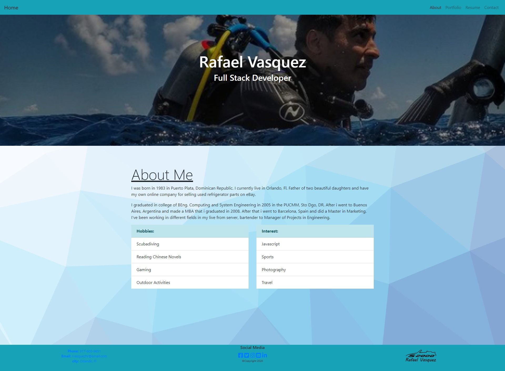
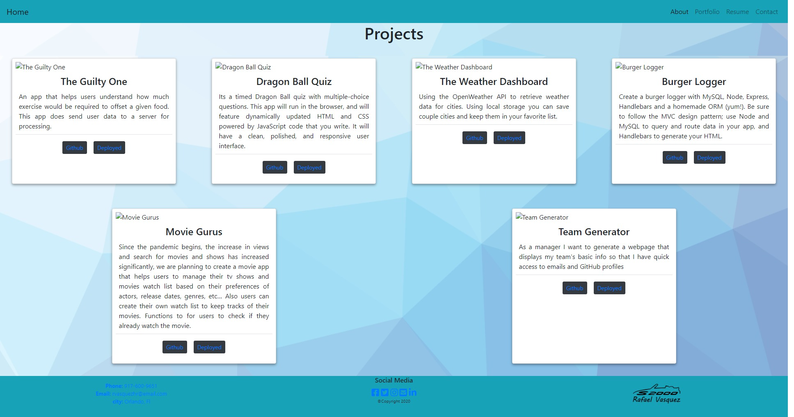
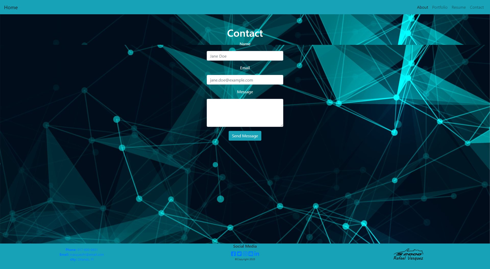

# Professional README Generator

## Task

Creating a portfolio using React will help set you apart from other developers whose portfolios do not use some of the latest technologies.

This is a portfolio website about Rafael Vasquez. Im a junior coder, just started the bootcamp. 
You can find here my past projects and past games i develop in the bootcamp. I hope you enjoy.

The application will be invoked by using the following command:

```bash
npm start
```

### Built With
----
```
  * HTML
  * Node.js
  * React
    - react-dom
    - react-router-dom
    - react-scripts
  * Javascript
  * Bootstrap
  * CSS
```    

### How to Use
----
```
  1- Type "npm start" in the console.
        * Runs the app in the development mode.\
        Open [http://localhost:3000](http://localhost:3000) to view it in the browser.

        * The page will reload if you make edits. You will also see any lint errors in the console.
```    
### Submission
---

Github Repo URL: 
[https://github.com/v1zconde/react_portfolio](https://github.com/v1zconde/react_portfolio)

Deployed URL: 
[https://v1zconde.github.io/react_portfolio](https://v1zconde.github.io/react_portfolio)


## Example
---
### Index


### Portfolio


### Contact


[Watch Video](https://drive.google.com/file/d/198mSNPS5vX4hvJrYrY68hM_IiGcKcbqJ/view)

  ## Questions
you have any questions about the repo, open an issue or contact me directly at rvasquez1@gmail.com. You can find more of my work at 
  Github: [v1zconde](http://github.com/v1zconde)
